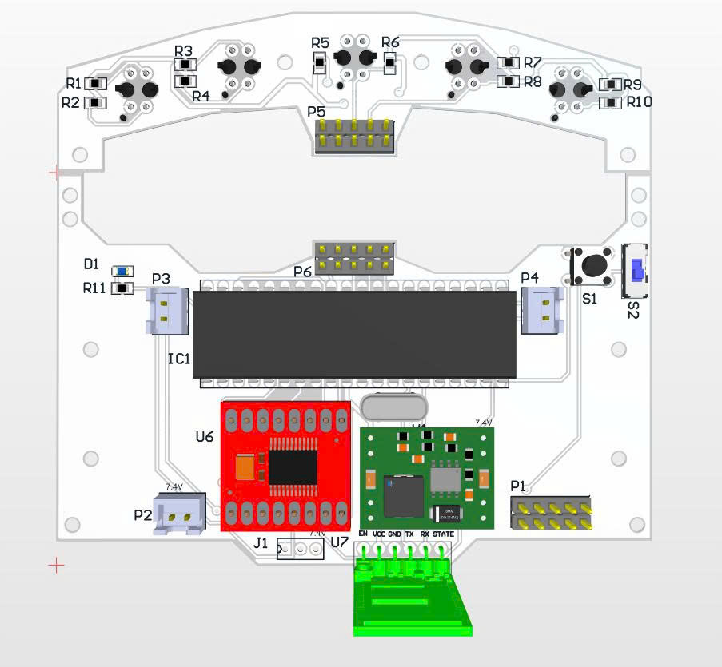
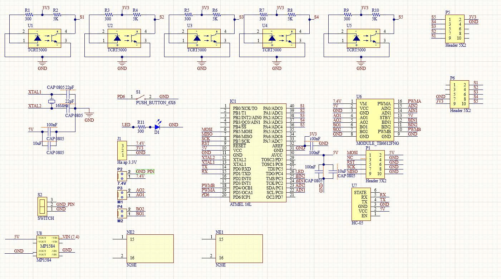
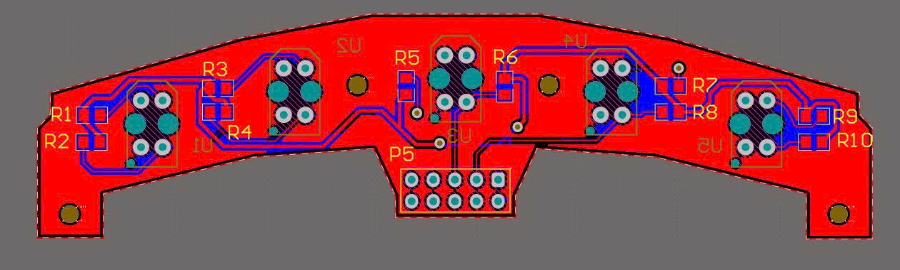
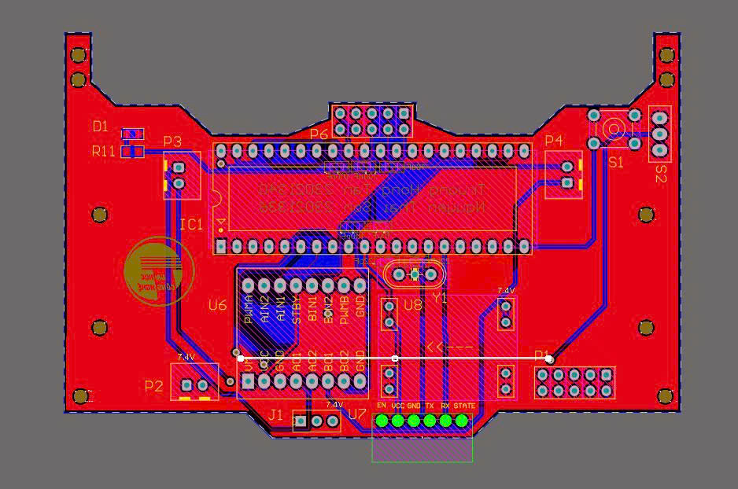
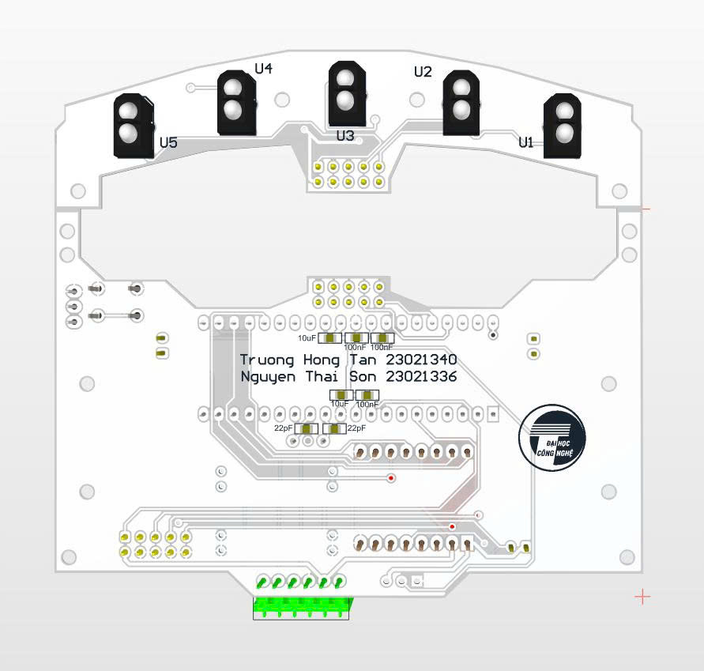

# ATmega16 Line Follower Robot 🚗

## 📖 Project Overview
This repository contains the hardware design and firmware for an autonomous Line Follower Robot. The core of this project is the **Atmel ATmega16** microcontroller, which processes data from an array of infrared sensors to keep the robot exactly on the track. 

This project is perfectly suited for robotics competitions or as a comprehensive learning platform for embedded C programming, PCB design, and control algorithms (like PID).

## ✨ Key Features
*   **Microcontroller:** ATmega16L (AVR architecture)
*   **Sensors:** 5 x TCRT5000 IR sensors for precise line detection.
*   **Motor Driver:** TB6612FNG module, capable of driving two DC motors efficiently.
*   **Wireless Tuning:** Integrated HC-05 Bluetooth module for real-time parameter tuning and debugging.
*   **Power Management:** MP1584 Buck Converter to step down voltage safely for the logic circuit.

## 🛠️ Hardware Design
The PCB was designed using Altium Designer].

### Schematics
The general schematic for the main board:

### PCB Layout
**PCB1 Layer Routing:**

**PCB2 Layer Routing:**

### 3D Renders
**Top View:**

**Bottom View:**

## 💻 Software & Firmware
*   **Language:** C/C++
*   **IDE:** [e.g., Microchip Studio (Atmel Studio) / VS Code with PlatformIO]
*   **Control Algorithm:** [Mention if you use PID control, e.g., Standard PID controller implemented for smooth line tracking.]

## 🚀 How to Use / Setup
1. **Firmware:** Open the project in your IDE, compile the code, and flash the `.hex` file to the ATmega16 using an ISP programmer (like USBasp).
2. **Calibration:** Place the robot on a track with a distinct line (e.g., black line on a white background). Use the Bluetooth module to connect with a mobile app or serial terminal to adjust the PID parameters.

## 🎥 Demonstration
